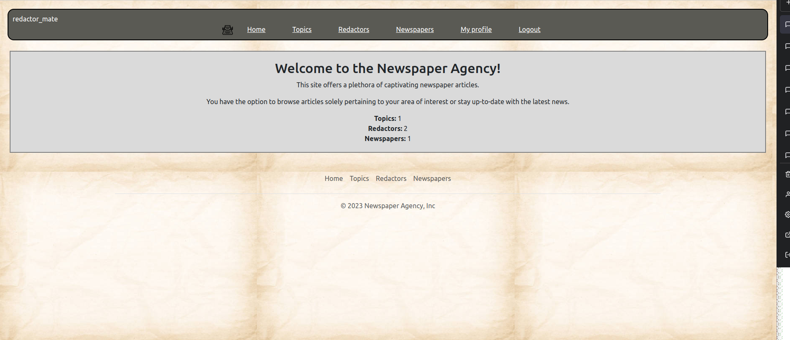

# NewspaperAgency

The Django-based project allows users to keep track of news articles on various topics that they find interesting.

## Installation
- git clone https://github.com/OmeLchDO/NewspaperAgency
- python3 -m venv venv
- source venv/bin/activate
- pip install -r requirements.txt
- python manage.py migrate
- python manage.py runserver

## Check it out
User:
- login: adminuser
- password: qqqqqqq1

## Features
You have the option to view news related to your preferred topic by selecting it from the list of topics and accessing the detailed information. Take a look at our editors and the newspapers they work for, and read fascinating articles.

## DEMO

